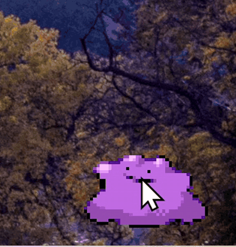
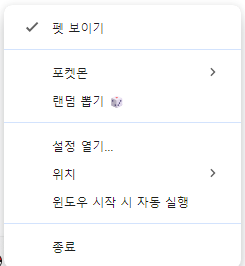

<div align="center">

# 🐾 포켓몬 데스크탑 펫

**윈도우 바탕화면에 포켓몬을 펫처럼 띄워 두는 Electron 앱**

   

</div>

<br />

## 💁🏻‍♂️ 소개

> 바탕화면 구석에서 포켓몬이 걷고, 자고, 클릭하면 울음소리로 반응하는 데스크탑 펫.<br>
> 투명·프레임리스·항상 위 창 하나로 동작하고, 빈 영역은 클릭이 바탕화면으로 통과.<br>
> 멀티모니터·세로 모니터 환경 대응, 트레이·설정 창·자동 실행까지 포함한 포터블 exe.

- 대상 포켓몬: 이상해씨 · 파이리 · 꼬부기 · 피카츄 · 메타몽 · 이브이 (+ 1/16 확률 이로치)
- 로컬 전용 · 비영리 개인 팬 프로젝트
- 설계·트러블슈팅 상세는 [DEVELOPMENT.md](DEVELOPMENT.md)

<p align="center"></p>

<br />

## 🦾 기능

### 🖱️ 상호작용
클릭 시 반응 모션 + 울음소리(PokeAPI cries). 드래그하면 버둥거리고, 놓으면 바닥까지 낙하 후 착지. 펫의 몸 위에서만 마우스를 잡고 빈 영역은 클릭 통과.

### 🚶 자율 행동
상태머신(IDLE / WALK / DRAG / FALL / SLEEP) 기반. 정해진 범위 안에서 가끔 산책, 일정 시간 무반응 또는 밤 시간대(기본 22~07시)엔 수면. 기상 직후 잠시 굼뜨게 움직임. 바닥 그림자 + 보행 bobbing.

### 💬 말풍선 · 알림 반응
가끔 한마디와 시간대 코멘트, 포켓몬별 고유 대사. 윈도우 알림이 오면 하던 걸 멈추고 그쪽을 쳐다봄(잠금 해제·절전 복귀에도 반응).



### 🖥️ 멀티모니터
연결된 모니터를 모델명·해상도·회전까지 감지해 배치도로 표시, 클릭해서 펫을 올릴 화면 선택. 코너 4방향 배치, DPI·작업표시줄 자동 보정. 모니터를 끄면 다른 화면으로 피했다가 다시 켜면 복귀.

### ⚙️ 설정 · 트레이
설정 창에서 크기·속도·산책 범위·위치·수면 시각 조절, 바꾸는 즉시 반영. 몬스터볼 트레이 아이콘으로 숨기기/다시 부르기. 윈도우 시작 시 자동 실행. 설정은 `config.json`에 저장.



### 🎲 랜덤 뽑기
우클릭 메뉴에서 무작위 포켓몬 뽑기. 1/16 확률로 이로치.

<br />

## 🔧 문제 해결

실사용 중 겪은 문제와 원인 분석. 전체 기록은 [DEVELOPMENT.md §14](DEVELOPMENT.md#14-트러블슈팅-기록).

### 앱 전체가 먹통 — 세로 모니터에서만 발생 (v0.3.0)
- **증상**: 클릭·드래그·우클릭 모두 무반응, GIF는 계속 재생
- **진단**: 렌더러 프로세스 CPU를 3초간 측정 → 3.22초 소모 = 코어 1개 100% 점유. 크래시가 아니라 동기 루프에 갇힌 행(hang)
- **원인**: 산책 목적지 추첨이 종료 조건 없는 rejection sampling. 세로 모니터(1080px)에서 산책 범위 162px < 요구 이동 거리 조건을 만족하는 해가 없는 구간이 생김. v0.2.1의 창 여백 추가와 v0.3.0의 "걷는 중 클릭하면 멈춤"이 겹쳐서 드러난 잠재 버그
- **수정**: 추첨 12회 상한 + 실패 시 더 먼 쪽 끝으로 폴백. 산책 범위 기준을 "화면 가로폭 15%" → "펫 너비 3배"로 변경 (세로 모니터 162px → 750px)

### 투명 영역이 클릭을 가로챔 (v0.5.1)
- **증상**: 크기를 4배까지 키울 수 있게 되면서 투명한 창(499×557px)이 좌하단 바탕화면 아이콘을 가림
- **수정**: 창은 기본 클릭 통과(`setIgnoreMouseEvents(true, { forward: true })`), 커서 아래 **픽셀 알파값**으로 펫 몸 위일 때만 잡음. 좌우반전·`object-fit` 보정, 관용 반경 4px, 드래그 중엔 판정 생략
- **결과**: 마우스를 막는 면적 **100% → 27.3%** (사각형 판정이었다면 59%)

### 모니터를 옮기면 예전 자리로 순간이동 (v0.4.0)
- **원인**: 렌더러가 들고 있는 좌표계 사본(작업영역·바닥 높이·위치)이 초기화 때 한 번만 설정되고 갱신되지 않음. 갱신용 IPC는 만들어 두고 호출하는 곳이 없었음
- **수정**: 갱신 경로를 3개(메인 재배치 시 푸시 · 드롭 직후 폴 · 초기화)로 명시하고 `applyGeometry()` 한 곳으로 통합

### 알림 감지가 간헐적으로만 동작 (v0.5.0)
- **배경**: Electron에는 OS 알림을 관찰하는 API가 없음 → 윈도우 알림 DB의 WAL 파일 변화를 감지하는 방식 채택
- **원인**: `fs.watch`가 알림 서비스가 열어 둔 채 쓰는 파일의 변경을 지연·누락. 한 번 성공한 관측을 근거로 "Electron 토스트는 안 뜬다"는 잘못된 가설을 세웠다가, 알림 센터와 WAL 내용을 직접 확인해 반증
- **수정**: 파일 크기 폴링(1.5초)으로 교체 → 토스트 발생 **+0.3초**에 안정적으로 포착, 유휴 시 오탐 0건. 알림 내용은 읽지 않음

<br />

## 🤓 시작하기

**Prerequisites**

- Windows 10/11
- [Node.js](https://nodejs.org/) 18+

**실행**

```bash
# 의존성 설치 (폴더를 옮겼거나 처음 받았을 때)
npm install

# PokeAPI에서 스프라이트·울음소리 다운로드 (최초 1회)
npm run fetch

# 앱 실행
npm start

# 콘솔 창 없이 실행: start-pet.vbs 더블클릭

# 포터블 exe 빌드 → dist/PokemonPet.exe
npm run dist
```

> 스프라이트·울음소리(`assets/sprites/`, `assets/cries/`)는 저작권 문제로 저장소에 포함하지 않음. `npm run fetch`가 [PokeAPI/sprites](https://github.com/PokeAPI/sprites)에서 직접 받아옴.<br>
> `node_modules/`도 저장소에 없으므로, 폴더를 옮긴 뒤 `start-pet.vbs`가 반응이 없으면 `npm install`부터.

<br />

## 📚 기술 스택

| 역할 | 종류 |
| :--- | :--- |
| Runtime |  — 투명·프레임리스·항상 위 창, 멀티모니터 좌표 제어 |
| Language |  — 빌드 도구 없음 |
| 구조 | 메인/렌더러 분리 + `contextIsolation` preload 브리지, `requestAnimationFrame` 상태머신 루프 |
| Asset | PokeAPI Gen5 애니메이션 스프라이트(GIF) · cries |
| Build | electron-builder — 단일 포터블 exe |

<br />

## 📂 폴더 구조

```
├── 📜 main.js            메인 프로세스 — 창 생성·모니터 배치·메뉴·트레이·IPC·설정·알림 감지
├── 📜 preload.js         렌더러 ↔ 메인 브리지 (contextBridge)
├── 📂 renderer
│   ├── index.html        펫 표시용 투명 페이지
│   ├── pet.js            상태머신·물리·마우스 판정·말풍선·수면
│   ├── style.css         스프라이트 배치·모션 애니메이션
│   └── settings.*        설정 창
├── 📂 scripts
│   ├── fetch-sprites.js  PokeAPI에서 스프라이트·울음소리 받기
│   └── make-icons.js     몬스터볼 아이콘 PNG 생성 (zlib만으로 직접 인코딩)
├── 📂 assets             아이콘 (스프라이트·울음소리는 fetch로 채움, git 제외)
├── 📂 docs               README 데모 GIF · 스크린샷
├── 📜 start-pet.vbs      콘솔 없이 실행하는 런처
└── 📕 DEVELOPMENT.md     설계·트러블슈팅 문서
```

<br />

## 🗂️ 버전 기록

<details>
<summary>v0.1.0 ~ v0.5.1 전체 기록</summary>

### v0.5.1 — 클릭 통과 수정
- 🖱️ **투명 영역이 마우스를 먹던 문제 수정** — 펫 창은 점프 모션용 여백 때문에 스프라이트보다 크고, 스프라이트 자체도 절반 이상이 투명하다. 그런데 창 전체가 클릭을 가로채서 **좌하단 바탕화면 아이콘이 눌리지 않았다**. 이제 커서 아래 **픽셀의 투명도를 보고** 펫의 몸 위에서만 창이 마우스를 잡는다 (마우스를 막는 면적 **100% → 27%**)
- v0.5.0에서 크기를 4배까지 키울 수 있게 되면서 이 문제가 커졌다 (scale 4 기준 499×557px의 투명한 벽)
- 끌고 가는 동안에는 커서가 몸을 벗어나도 놓치지 않는다

### v0.5.0 — 시스템 통합
- 🧰 **트레이 아이콘 추가** — 좌클릭으로 **펫 숨기기/다시 부르기**, 우클릭 메뉴에서 포켓몬 전환·랜덤 뽑기·위치·자동 실행·종료. 아이콘(몬스터볼)은 외부 이미지 없이 **코드로 그려서 생성**한다
- ⚙️ **설정 창 추가** — `config.json`을 손으로 고치던 것을 GUI로 대체. 크기·걷는 속도·산책 범위/간격·모니터·코너·여백·말풍선 간격·수면 시각·포켓몬을 슬라이더와 드롭다운으로 조절하고, **끄는 즉시 펫에 반영**된다 (트레이 더블클릭 또는 우클릭 → 설정 열기)
- 🖵 **모니터 감지 & 직접 선택** — "맨 왼쪽/맨 오른쪽" 같은 상대 지정만으로는 모니터가 3대일 때 가운데를 못 고른다. 이제 **연결된 모니터를 모델명·해상도·회전까지 감지**해 목록으로 보여주고, 설정 창의 **배치도(실제 배치를 비율 그대로 축소)**를 클릭해서 고른다. 지정한 모니터를 꺼두면 잠시 다른 화면으로 피했다가 **다시 켜면 원래 자리로 돌아온다**
- 🚀 **윈도우 시작 시 자동 실행** — 부팅하면 알아서 등장. 설정 창/트레이에서 on/off
- 🔔 **알림 반응 추가** — 윈도우 알림이 뜨면 펫이 하던 걸 멈추고 그쪽을 쳐다보며 한마디. 잠금 해제·절전 복귀에도 반응한다. **자고 있을 땐 알림에 깨지 않는다**
- 📐 **크기 변경이 즉시 반영** — 예전엔 `scale`을 바꿔도 재시작해야 창 크기가 따라왔다. 이제 발밑을 고정한 채 실시간으로 커지고 작아진다
- ♻️ **설정 경로 일원화** — 우클릭 메뉴·트레이·설정 창 어디서 바꿔도 서로 값이 어긋나지 않는다 (토글 전용 IPC 채널 4개를 설정 방송 하나로 통합)

### v0.4.0 — 모니터 환경 대응
- 🖥️ **배치 위치 설정화** — 우클릭 → **위치**에서 모니터(맨 왼쪽/맨 오른쪽/주)와 코너(4방향)를 선택. 책상 배치가 바뀌어도 코드 수정이 필요 없다
- 📐 **산책 범위 기준 변경** — "화면 가로폭의 15%" → **"펫 너비의 3배"**. 세로 모니터에서 162px로 쪼그라들던 문제 해결 (모니터 종횡비와 무관하게 일정)
- 🔄 **좌표계 재동기화** — 모니터를 뺐다 꽂거나 펫을 다른 모니터로 옮기면 **예전 자리로 순간이동하던 문제 수정**. 낙하 바닥·산책 범위도 옮긴 모니터 기준으로 다시 계산
- 🛟 **화면 밖 이탈 방지** — 펫이 보이지 않는 곳으로 나가면 가장 가까운 모니터 안으로 되돌린다 (모니터 간 드래그는 그대로 허용)

### v0.3.0
- 🌑 **바닥 그림자** 추가 — 발밑 타원 그림자로 "땅에 서 있는" 느낌 (드래그/낙하 중엔 사라지고, 수면 중엔 옅어짐)
- 🚶 **보행 모션** 추가 — 걷기 전용 스프라이트 없이 좌우반전 + 위아래 bobbing으로 걷는 느낌, 그림자도 같은 주기로 연동
- 🎲 **랜덤 뽑기** 추가 — 우클릭 메뉴에서 무작위 포켓몬 뽑기, **1/16 확률로 이로치** 당첨 시 축하 말풍선
- ✂️ **이로치 토글 메뉴 제거** — 이로치는 랜덤 뽑기로만 만나는 깜짝 요소로 변경
- 🐛 포켓몬을 바꿔도 항상 "피카!"라고 말하던 버그 수정 — 대사를 **포켓몬별로 분리**
- 🐛 걷는 도중 클릭하면 반응 모션이 묻힌 채 계속 걸어가던 문제 수정 (클릭하면 그 자리에 멈춤)
- 🐛 **앱이 통째로 멈추던 문제 수정** — 산책 범위가 좁은 모니터(예: 세로 모니터)에서 목적지 추첨이 무한 루프에 빠져 클릭·우클릭이 모두 먹통이 되던 현상

### v0.2.1
- 🪂 **드롭 낙하** — 들어올렸다 놓으면 그 자리에 멈추지 않고 중력으로 **바닥까지 떨어져** 착지
- 😪 **기상 후 둔화** — 수면에서 깨어난 직후 몇 초간 굼뜨게(느린 이동·반응) 움직이다 서서히 회복
- 🐣 점프/버둥 시 창 크기 제한으로 **머리가 잘리던 문제 수정** (창에 상단·좌우 여백 확보)

### v0.2.0
- 🤾 **드래그 모션** 추가 — 들어올림(버둥) / 놓음(통통 착지)
- 🔊 **울음소리** 추가 — 클릭 시 PokeAPI cries 재생, 메뉴 토글
- 💬 **말풍선** 추가 — 랜덤 한마디 + 시간대 코멘트, 메뉴 토글
- 😴 **수면 모드** 추가 — 유휴/야간 Zzz, 상호작용 시 기상, 메뉴 토글
- 산책 범위를 좌하단 기준으로 재정렬(이전 릴리스에서 우측 기준으로 남아 있던 버그 수정)

### v0.1.1
- 펫 배치 위치를 **왼쪽 모니터 좌하단**으로 변경

### v0.1.0 — 초기 릴리스
- 6종 포켓몬 지원 (이상해씨·파이리·꼬부기·피카츄·메타몽·이브이)
- Gen5 애니메이션 스프라이트 + 이로치 토글
- 클릭 반응 / 드래그 이동 / 우클릭 전환 메뉴
- 자율 산책 (IDLE / WALK / DRAG 상태머신)
- 멀티모니터 자동 배치, DPI·작업표시줄 보정
- 설정 영속화 (`config.json`)
- 포터블 exe 빌드 지원

</details>

<br />

## 📜 라이선스 / 고지

- 이 저장소의 **소스 코드**는 MIT 라이선스로 제공됩니다.
- **포켓몬 및 모든 스프라이트의 저작권은 Nintendo / Creatures Inc. / GAME FREAK inc. / The Pokémon Company에 있습니다.**
- 본 프로젝트는 **비영리 개인 팬 프로젝트**이며 위 권리자와 제휴·후원·승인 관계가 없습니다.
- 스프라이트 에셋은 재배포하지 않으며, 실행 시 PokeAPI를 통해 각자 내려받습니다.
- 상업적 이용을 금합니다.
